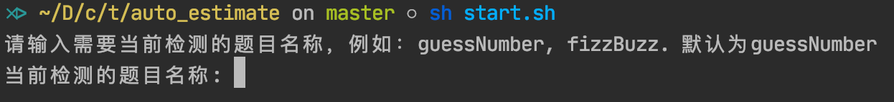
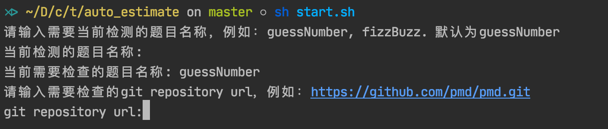
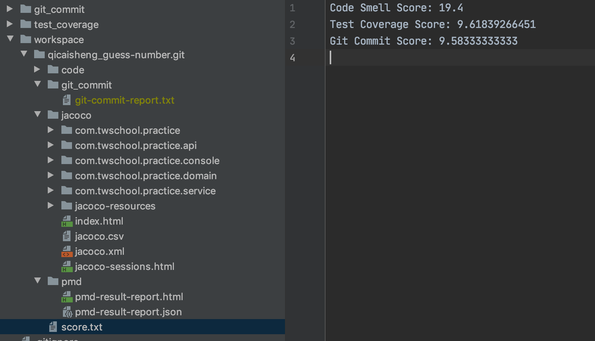
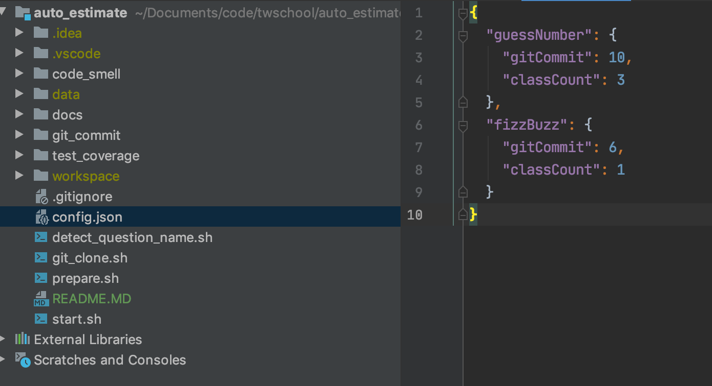

# Auto Estimate

## How to use
- `git clone https://github.com/qicaisheng/auto_estimate.git`
- `cd auto_estimate`
- `sh start.sh`
- input question name

- input git repo url

- see the report and score

## How to config

